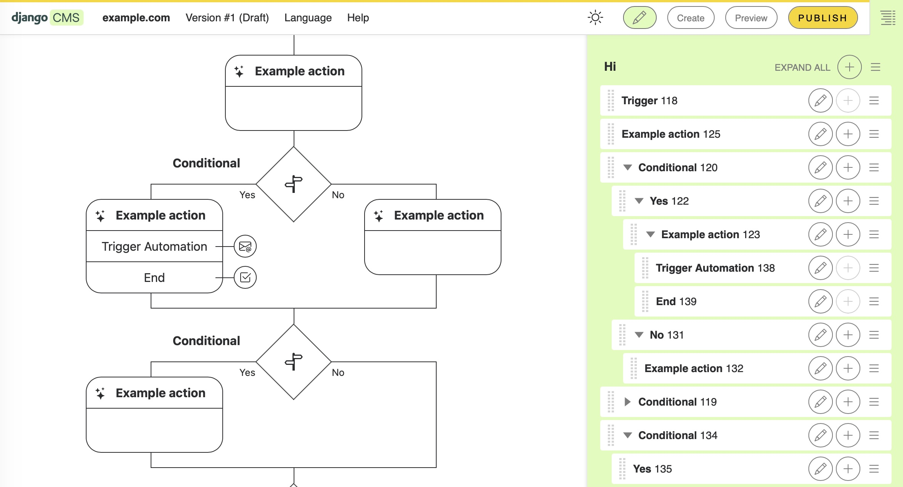

djangocms-automation
====================

This package extends django CMS with the ability to model and edit automation workflows directly in the Frontend Editor (inline editing). Workflows are composed from CMS plugins (e.g., Triggers, Conditions/If‑Then‑Else, Actions, End) and can be arranged on the page via drag & drop like regular content.

Overview
- Frontend Editor: Edit workflows right on the page — no separate admin UI required.
- Building blocks as plugins: Trigger, If/Then/Else, Action, and End are available as dedicated plugins.
- Templates & assets: Project templates live under `templates/djangocms_automation/...` and static assets under `static/...`.

Installation
------------

Install the package from GitHub:

```bash
pip install git+https://github.com/fsbraun/djangocms-automation.git
```

Add `djangocms_automation` to your `INSTALLED_APPS`:

```python
INSTALLED_APPS = [
    # ...
    "djangocms_automation",
    # ...
]
```

Run migrations:

```bash
python manage.py migrate djangocms_automation
```

### Running Automations

Automations are executed via background tasks. Set up a periodic task to process pending automations, for example using a cron job (every minute):

```bash
* * * * * cd /path/to/project && python manage.py shell -c "from djangocms_automation.tasks import execute_pending_automations; execute_pending_automations()"
```

Alternatively, use [Django-Q2](https://django-q2.readthedocs.io/), [Celery](https://docs.celeryq.dev/), or Django 6.0+ background tasks.

Quick start
-----------

- Create automations from the admin, view and edit them using django CMS' frontend editor.
- Add the required building blocks (Trigger, If/Then/Else, Action, End) in the Frontend Editor and configure them.




Documentation
-------------

1. Create the docs virtual environment and install requirements:

   ```bash
   cd docs
   make install
   ```

2. Build the HTML documentation (uses the venv's Sphinx):

   ```bash
   cd docs
   make html
   ```

3. Open the built docs in your browser:

   ```bash
   open _build/html/index.html
   ```
