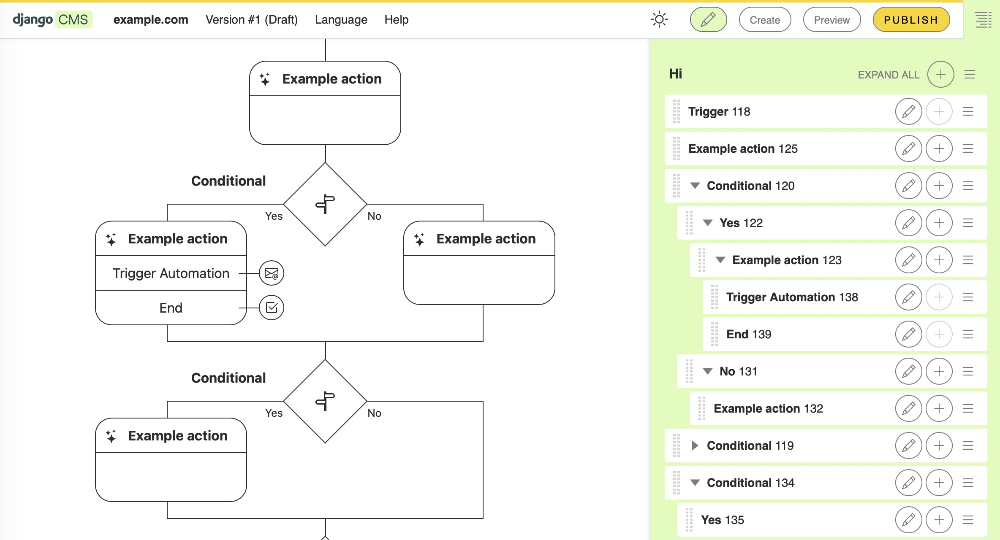

djangocms-automation
====================

[](https://www.python.org/)
[](https://www.djangoproject.com/)
[](https://www.django-cms.org/)
[](https://github.com/fsbraun/djangocms-automation/blob/main/LICENSE)

This package extends django CMS with the ability to model and edit automation workflows directly in the Frontend Editor (inline editing). Workflows are composed from CMS plugins (e.g., Triggers, Conditions/If‑Then‑Else, Actions, End) and can be arranged on the page via drag & drop like regular content.

Overview
- Frontend Editor: Edit workflows right on the page — no separate admin UI required.
- Building blocks as plugins: Trigger, If/Then/Else, Action, and End are available as dedicated plugins.
- Templates & assets: Project templates live under `templates/djangocms_automation/...` and static assets under `static/...`.

Installation
------------

Install the package from GitHub:

```bash
pip install git+https://github.com/fsbraun/djangocms-automation.git
```

Add `djangocms_automation` to your `INSTALLED_APPS`:

```python
INSTALLED_APPS = [
    # ...
    "djangocms_automation",
    # ...
]
```

Run migrations:

```bash
python manage.py migrate djangocms_automation
```

### Running Automations

Automations are executed via background tasks. Set up a periodic task that revives paused actions and fires due timer triggers, for example using a cron job (every minute):

```bash
* * * * * cd /path/to/project && python manage.py runautomations
```

Alternatively, schedule `call_command("runautomations")` with [Django-Q2](https://django-q2.readthedocs.io/), [Celery](https://docs.celeryq.dev/), or Django 6.0+ background tasks.

For local development, `djangocms_automation.utils.ThreadBackend` can execute tasks outside the request thread with a bounded in-process thread pool:

```python
TASKS = {
    "default": {
        "BACKEND": "djangocms_automation.utils.ThreadBackend",
        "OPTIONS": {"MAX_WORKERS": 4},
    }
}
```

This backend is non-durable: work and results are process-local and are lost on restart or termination. It has no retry or crash recovery and should only be used for development or non-critical best-effort work. Use a persistent queue backend with separate workers for production automations that must run reliably.

### Built-in actions

- **Send Email** — one email per data row via Django's email framework.
- **Create / Update / Query Records** — Django model CRUD, gated by the `AUTOMATION_ALLOWED_MODELS` setting.
- **LLM Prompt** — provider-independent LLM calls via [LiteLLM](https://docs.litellm.ai/) (`pip install djangocms-automation[llm]`, models via `AUTOMATION_LLM_MODELS`, API keys in the admin *Secrets* store).
- **Wait for User** — human-in-the-loop pause/resume from the admin.

Flow control includes conditionals (If/Then/Else with a visual condition builder), parallel splits with automatic joins, and timer/form/manual/code/webhook triggers.

### Webhooks

Include `path("automation/", include("djangocms_automation.urls"))` in your urlconf, then give an automation a *Webhook* trigger: any service can start it by POSTing JSON to the trigger's secret URL (`/automation/webhook/<token>/`), optionally authenticated with an HMAC signing secret. The *Mail* trigger builds on this for inbound email — point your mail provider's webhook at it and filter by recipient/subject/status. Custom webhook trigger types are a small `WebhookTrigger` subclass away.

Quick start
-----------

- Create automations from the admin, view and edit them using django CMS' frontend editor.
- Add the required building blocks (Trigger, If/Then/Else, Action, End) in the Frontend Editor and configure them.




Documentation
-------------

1. Create the docs virtual environment and install requirements:

   ```bash
   cd docs
   make install
   ```

2. Build the HTML documentation (uses the venv's Sphinx):

   ```bash
   cd docs
   make html
   ```

3. Open the built docs in your browser:

   ```bash
   open _build/html/index.html
   ```
