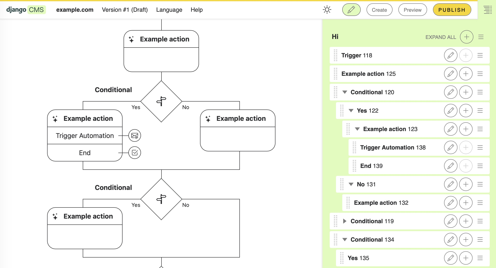

djangocms-automation
====================

[](https://pypi.org/project/djangocms-automation/)
[](https://pypi.org/project/djangocms-automation/)
[](https://pypi.org/project/djangocms-automation/)
[](https://codecov.io/gh/fsbraun/djangocms-automation)
[](https://github.com/fsbraun/djangocms-automation/blob/main/LICENSE)

This package extends django CMS with the ability to model and edit automation workflows directly in the Frontend Editor (inline editing). Workflows are composed from CMS plugins (e.g., Triggers, Conditions/If‑Then‑Else, Actions, End) and can be arranged on the page via drag & drop like regular content.

Overview
- Frontend Editor: Edit workflows right on the page — no separate admin UI required.
- Building blocks as plugins: Trigger, If/Then/Else, Action, and End are available as dedicated plugins.
- Templates & assets: Project templates live under `templates/djangocms_automation/...` and static assets under `static/...`.

Installation
------------

Install the package from GitHub:

```bash
pip install git+https://github.com/fsbraun/djangocms-automation.git
```

Add `djangocms_automation` to your `INSTALLED_APPS`:

```python
INSTALLED_APPS = [
    # ...
    "djangocms_automation",
    # ...
]
```

Run migrations:

```bash
python manage.py migrate djangocms_automation
```

### Running Automations

A production deployment runs three processes: the **web** server enqueues work
but never executes it, one or more **workers** execute it, and a **scheduler**
fires timers, revives retries, and recovers work whose worker died.

```python
TASKS = {
    "default": {
        "BACKEND": "djangocms_automation.backends.DatabaseBackend",
        "QUEUES": ["default"],
    }
}
```

```bash
python manage.py runworker                 # one or more; add more for throughput

* * * * * cd /path/to/project && python manage.py runautomations   # every minute
```

`DatabaseBackend` is durable: enqueued work is a database row claimed under a
lease, so it survives a restart and a killed worker's task is released and
retried. Django's built-in `ImmediateBackend` executes inline (fine for tests,
not for production) and `djangocms_automation.utils.ThreadBackend` runs tasks in
an in-process thread pool that is lost on exit — development only.

**Reliability.** Actions carry attempt counts, execution leases, timeouts, and
a full state-transition history. Failures are retried according to a per-plugin
`RetryPolicy` with exponential backoff and jitter; retries are distinguished
from re-entries, so a split or a paused action never consumes its retry budget.
Actions that exhaust their attempts, or whose worker died with no attempts left,
are dead-lettered and can be replayed from the admin without editing the
database. Running executions can be canceled. The scheduler may run on several
hosts — it takes a database lock, so exactly one tick happens at a time.

See the [deployment guide](docs/source/howto/deployment.rst) for the full
contract, settings, retention, and health signals.

### Trying it out

The repository ships a demo project running the full production shape against
SQLite:

```bash
cd demo
python manage.py migrate
python manage.py seedautomations    # admin/admin, plus reference automations
python manage.py runserver
python manage.py runworker          # in a second shell
```

`seedautomations --scenario killed-worker` (and `timeout`,
`enqueue-rejection`, `duplicate-webhook`, `timer-backlog`) injects failure
conditions so recovery can be watched rather than only trusted.

### Built-in actions

- **Send Email** — one email per data row via Django's email framework.
- **Create / Update / Query Records** — Django model CRUD, gated by the `AUTOMATION_ALLOWED_MODELS` setting.
- **LLM Prompt** — provider-independent LLM calls via [LiteLLM](https://docs.litellm.ai/). Install with `pip install djangocms-automation[llm]` and add `"djangocms_automation.ai"` to `INSTALLED_APPS`; models via `AUTOMATION_LLM_MODELS`, API keys in the admin *Secrets* store.
- **Wait for User** — human-in-the-loop pause/resume from the admin.

- **Agent** — an LLM that chooses and calls the tools you give it, looping until it has an answer. Each tool wraps one of the actions above, and you decide which of that action's inputs the model may fill: it can write an email's subject and body while the recipient stays bound to your expression. Every tool call is a first-class execution step — inspectable, retryable, and pausable for human approval before anything irreversible runs. Bounded by turns, tool calls, tokens and wall clock; reaching a limit fails the run rather than returning a confident half-answer.

Flow control includes conditionals (If/Then/Else with a visual condition builder), while loops with a bounded iteration count, parallel splits with automatic joins, and timer/form/manual/code/webhook triggers.

### Webhooks

Include `path("automation/", include("djangocms_automation.urls"))` in your urlconf, then give an automation a *Webhook* trigger: any service can start it by POSTing JSON to the trigger's secret URL (`/automation/webhook/<token>/`), optionally authenticated with an HMAC signing secret. The *Mail* trigger builds on this for inbound email — point your mail provider's webhook at it and filter by recipient/subject/status. Custom webhook trigger types are a small `WebhookTrigger` subclass away.

Quick start
-----------

- Create automations from the admin, view and edit them using django CMS' frontend editor.
- Add the required building blocks (Trigger, If/Then/Else, Action, End) in the Frontend Editor and configure them.




Documentation
-------------

1. Create the docs virtual environment and install requirements:

   ```bash
   cd docs
   make install
   ```

2. Build the HTML documentation (uses the venv's Sphinx):

   ```bash
   cd docs
   make html
   ```

3. Open the built docs in your browser:

   ```bash
   open _build/html/index.html
   ```
